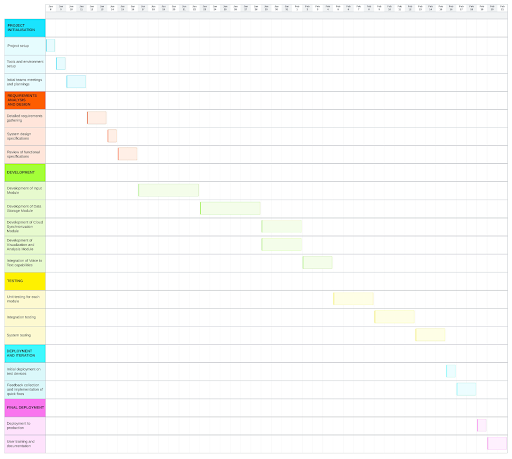
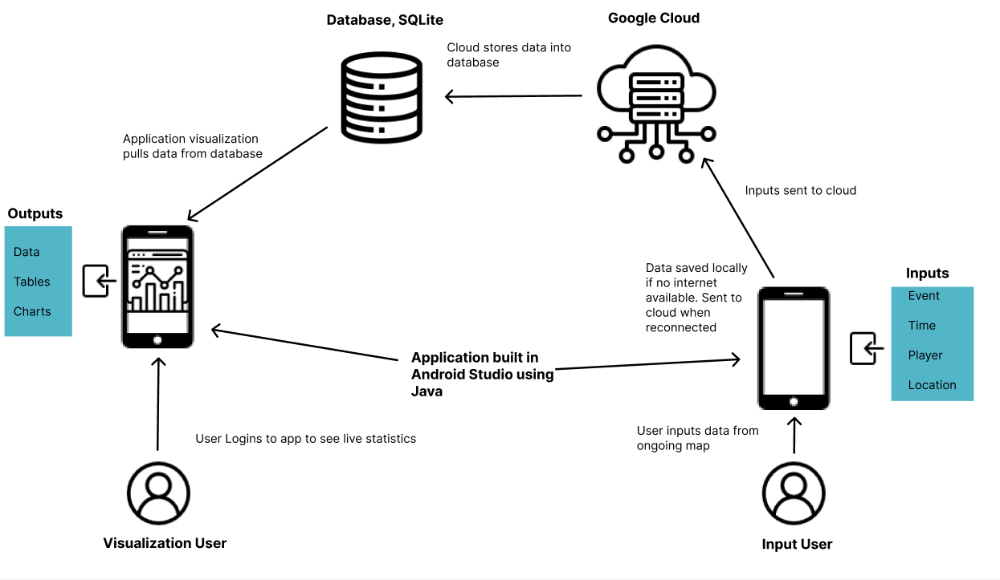
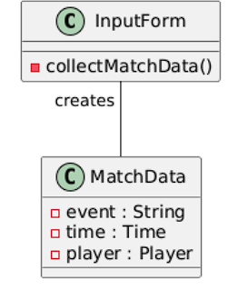
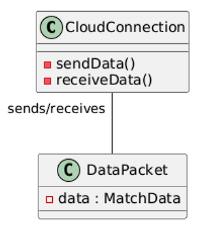
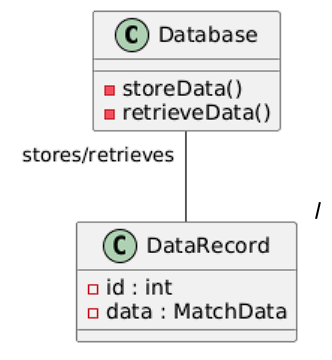
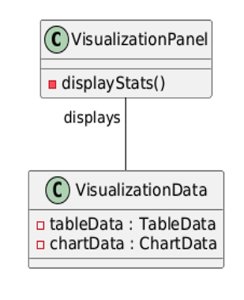
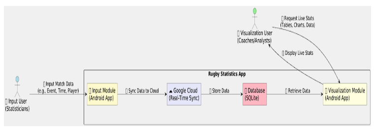

# Functional Specification

## Functional Specification for  
Rugby Statistics App

### Project Partners:

Liam Wrafter - 22411932  
Lotanna Nnoli - 22385256  

---

## Table of contents

1. Introduction ...………………………..……………………………………………………. 2  
2. General Description ...………………………..…………………………………………… 3  
3. Functional Requirements ...………………………..……………………………………...11  
4. System Architecture …………………………………………..………………………….. 16  
5. High-Level Design ……………………………………………..………………………..... 19  
6. Preliminary Schedule ………………..…………………………..……………………….. 22  
7. Appendices ………………………………………………………..………………………..25  

---

### 1. Introduction

#### 1.1 Overview

Our Rugby Statistics App is aimed at being a cutting-edge Android mobile application designed to facilitate the collection, real-time sharing, and analysis of rugby match data.

It enables users at a game to input detailed match statistics on the fly. For instance, player actions like tackles, turnovers, tries, passes, lost balls, and penalties can be recorded, as well as the respective event locations, whilst allowing remote viewers, such as coaches, to access this data live.

The goal of the app would be to enhance decision-making during and after matches through the provision of actionable insights via graphical and statistical representations.

The system would also integrate a cloud-based infrastructure for real-time synchronisation of logged events as well as a normalised and secure SQLite database for storing historical data. The application aims to be user-friendly, prioritising simplicity in data entry and intuitive visualisation of metrics for technical and non-technical users alike.

#### 1.2 Business Context

Business-wise, the application would cater to teams and organisers of rugby matches. It would be aimed at improving performance through data-driven insights.

Within the scope of its use, coaches, players, and match analysts would then be able to utilise the system in:

- Refining their game strategies  
- Identifying strengths and weaknesses between their respective teams  
- Monitoring key performance metrics over time  

#### 1.3 Glossary

- **Cloud Synchronisation:** A means of updating data across devices in real-time via internet services. It allows changes made on one device to be reflected across all other connected devices immediately.  
- **Real-Time Data Synchronisation:** The continuous update and maintenance of data across different platforms, ensuring users have the most current information at all times.  
- **Normalisation:** Organising data in a database to reduce redundancy and improve data integrity.  
- **SQLite:** A lightweight, self-contained database engine used for local data storage on mobile devices.  
- **HTTPS (Hypertext Transfer Protocol Secure):** An internet protocol used for secure communication over a computer network. It encrypts data during transfer, which protects against tampering.  
- **Gantt Chart:** A project management tool that displays tasks along a timeline, showing the start and end dates, duration, and overlap of activities. It helps in visualising project schedules and resource allocation.  
- **Data Security:** Measures to protect digital information from unauthorized access, corruption, or theft throughout.  
- **Metrics:** Measurable aspects of gameplay, such as tackles, turnovers, or tries.  
- **Visualisation:** The graphical representation of data, such as charts or graphs.  

---

### 2. General Description

#### 2.1 Product / System Functions

The Rugby Statistics application has a few core functions within its design that allow gathering, visualising, and analysing data of rugby games in real-time. Elaborations of the most important functions are presented below.

**Recording Match Events**  

The app lets the input users record the detailed match events occurring during the game. In particular, this includes:  

- **Time of Event:** Timestamp of when the event is recorded is recorded automatically.  
- **Player Identification:** This identifies the player involved in the event from a predefined team roster.  
- **Event Location:** This captures the exact area on the pitch where the event has occurred, possibly using a visual pitch map or grid system.  
- **Type of Action:** Identifies the event type, such as tackle, turnover, try, pass, lost ball, and penalty.  

The application will have additional features for recording events, such as:  
- **Event Customisation:** Ability for users to define custom event types if needed.  
- **Error Handling:** Allows users to edit or delete events if incorrect input is recorded or if input errors occur.  

**Showing Live Statistics and Visualisations**  

The application will visualise real-time match data to remote users, such as coaches, in an interactive and animated manner:  

- **Statistics Dashboard:** This dashboard will show important metrics like the number of tackles, turnovers, and tries; ball possession rates; location-based event heatmaps.  
- **Graphical Representation:** Different chart types will be used to show information, such as bar charts for comparative player/teams' actions, line graphs showing trends over time, and pie charts to show proportional data such as ball possession. These such graphs could be used by users, for example, to highlight areas of concern and create better training plans for their team.  
- **Heatmaps:** Highlighting areas on the pitch with where any given event occurs often.  

This application will also contain various customisation options for users to better visualise the statistics. These customisation options are:  
- Filter data by player, event type, or time period.  
- Switch between different views, such as team performance versus individual player performance.  

**Allow Fetching of Historical Data for Post-Match Analytics**  

The application enables strong data storage and retrieval to support richer post-match analysis such as:  

- **Data Storage Capabilities:** Application includes data storage, whereby all recorded match events are stored in a locally stored SQLite database and synced with Google Cloud.  
- **Search and Filtering:** It allows users to search by match date, event type, or player for quick access to data.  
- **Report Generation:** It enables users to export data summaries and visualisations for further analysis or sharing with the team.  
- **Trend Analysis:** Allows the tracking of performance metrics longitudinally across many games to support the identification of recurring patterns or improvements.  

**Allow Real-Time Data Synchronisation using Google Cloud**  

The app will handle seamless real-time update data by synchronising the changes via cloud to provide users with consistency in experience across all devices connected to the platform devices:  

- **Real-time Updates:** The application uses real-time updates of match events resulting in real-time synchronisation into Google Cloud and, by extension, viewable to the end users remotely with limited latency.  
- **Device Compatibility:** Ensuring the data is presented properly on different Android devices.  
- **Conflict Resolution:** Ensures data accuracy and integrity by implementing mechanisms to deal with simultaneous updates from several input users.  
- **Data Security:** Ensures data security and privacy by using secure communications protocols, such as HTTPS, and authentication via Google Cloud services.  

We decided to implement cloud services into our application to take advantage of the other features of the cloud:  

- **Backup and Recovery:** Features prevent the loss of data.  
- **Local Caching of Data:** Allows entry during network interruptions and syncs automatically when network connections are reestablished.  

#### 2.2 User Characteristics and Objectives

Our application will be designed to cater to two distinct user groups. These two groups are Input Users and Visualisation Users. These users possess different levels of expertise, vary in objectives, and have specific needs, which the application addresses.

**Input Users**  

*Expected Expertise:*  
- **Software Systems:** Users will almost certainly have a moderate familiarity with mobile applications. Likely accustomed to basic data entry tasks but not with advanced technical tools.  
- **Application Domain:** Users of the application will likely have a good understanding about rugby gameplay and terminology, ensuring accurate data capture of in-game events.  

*Characteristics:*  
- Users will most likely be team staff, volunteers, or players not participating in the match, for example, injured players.  
- They will be operating under time-sensitive conditions during live matches.  
- Balancing data accuracy with the fast-paced nature of live sports.  

*Objectives from the User's Perspective:*  
- **Accurate Data Capture:** Users want to accurately log events such as player actions (tackles, tries) and match events (turnovers, penalties) in real-time.  
- **Efficient Workflow:** Users want to quickly and easily enter the necessary data without interrupting their observation of the game.  
- **Error Correction:** Users can make mistakes and may wish to edit or delete data; the application should make it easy to correct errors made.  
- **Offline Functionality:** The software should allow for continued data entry without network connectivity, syncing when a connection is re-established.  

*"Wish List" of Desirable Characteristics:*  
- **Visual Field Map:** A graphical pitch design based on a real pitch where events can be marked quickly.  
- **Auto-save:** Any interruption will not lead to data loss.  
- **Player Lists:** Pre-filled lists of players that can be input ahead of kick-off to reduce mundane typing.  
- **Quick Event Selection:** Big, different buttons for "Tackle," "Turnover," or "Try" for common actions, making it faster and easier to record data.  

*Practical Solutions Matching Business Goals:*  
- Simplify the user interface to a minimum number of taps per action.  
- The team rosters are pre-set to speed up player selection.  
- Integrating an auto-sync feature to move seamlessly from offline to online.  

---

**Visualization Users**

*Expected Expertise:*
- **Software Systems:** This section can vary. Some users might be proficient with high-end analytics platforms, whereas others may prefer simple data dashboards.
- **Application Domain:** Basic knowledge of different rugby tactics, player performance metrics, and strategic decision-making processes.

*Characteristics:*
- Often in a remote location during the match, accessing data from various locations such as training rooms or homes.
- High on performance metrics, being able to utilise them for taking data-driven decisions.
- Need very detailed yet easy-to-understand data visualisations.

*Objectives from the User’s Perspective:*
- **Real-time Updates:** Users want instantaneous access to live match data, including possession statistics, successful tackles, and opportunities to score.
- **Personalisation of Data:** Different options of filtering and sorting data according to various metrics, including player, team, event type, or time frame.
- **Post-match Analysis:** Reports for improvement in the next performance review.
- **Mobile Access:** Access data from any Android device regardless of location.

*A potential "Wish List" of Desirable Characteristics:*
- **In-the-moment Dashboards:** Live visual engagement with heat maps, bar charts, and trend lines to see what's happening.
- **Alerts and Notifications:** Automatic notifications of critical events in the game, such as tries scored and turnover frequency.
- **Historical Data Comparisons:** Tools to compare contemporary performances against historical match results.
- **Exportable Reports:** An export feature that enables data to be moved to spreadsheets or PDFs for thorough analysis.

---

#### 2.3 Operational Scenarios

In our application, there are two main scenarios where users interact with the app under different conditions. Both scenarios involve end-to-end transactions between the system, user, and environment with data input and real-time monitoring.

**On-Site Recording Statistics**

*Description of scenario:*
A user is at the side of the pitch, with a device such as a phone or tablet, running the application during a live match. When the match begins, the user will start to enter events into the application's input interface as they happen.

*Input Event:*
- A player tackles.
- The user will select the event "tackle" from the predefined list of events. They then will note the player number and the location on the pitch where the event occurred.
- Time-stamping of entries is automatically done by the application.

*Cloud Synchronization:*
- As soon as the input is completed in the application, the app tries synchronising using Google Cloud. If an internet connection is available, then the data is uploaded in real-time.
- If there is no internet connection available, the app stores the data locally and marks it for synchronization once a connection is reestablished.

*User experience:*
- Our input interface will be as streamlined as possible, so the user can input data quickly and doesn't require a lot of navigation to follow the fast pace of the game.

*Outcome:*
The application ensures data collection in real-time or very close to it without disruptions so that the data remains accurate even without an internet connection.

**Remote Viewing Statistics**

*Description of scenario:*
While the user is inputting statistics for a match, other users, such as a head coach in a remote training facility, can view live updated statistics of the same game.

*Live Access to Data:*
- The coach logs into the application to view the live statistics of the match.
- The application uses Google Cloud to synchronize data from the SQLite database and query it for the latest entries.

*Decision Making:*
- From the visualization dashboard, the coach finds that one player has made five consecutive mistakes in a short space of time, which, if continued, can lead to the opposing team scoring.
- This live data is utilized by the coach to communicate to other team staff at the match to replace the player.

*User Experience:*
- The data is available to the coach in the form of graphs, tables, and charts that are all updated in real-time with minimal delay.
- The coach can filter and sort data that's offered by the app's interface to focus on specific metrics such as turnovers.

*Outcome:*
The application acts as a real-time guide into critical insights that can be used to make strategic decisions that will contribute to the result.

---

#### 2.4 Constraints

Our application must meet several technical and practical constraints in respect of design, development, and deployment. These include performance-related constraints, industry protocol requirements, hardware limitations, and development-related issues.

**Requirements for Speed and Performance:**
The application should provide high performance and an excellent user experience as a selling point, especially for live matches where each second counts.

- **Real-time Data Input and Update:** The application is required to register events with minimum latency (preferably below a second) for real-time synchronisation by Google Cloud, while users of visualisation should witness updates as they happen without any noticeable delay.
- **Speed of Data Access and Display:** Historical queries (e.g., previous match statistics) should return results within less than a few seconds for a seamless post-match analysis experience.

*Challenges:*
- Stability of the app's performance under high-frequency data input during an intense match moment.
- Low latency during synchronisation depending on network conditions.

**Industry Protocols and Best Practices:**
Even though there are no prescribed government standards, the use of this app should still follow standard practice in mobile app development and data security.

- **Data Security:** The application should comply with secure practices regarding data handling. This includes secure transmission of data, such as using HTTPS, and protecting user data with Google Cloud authentication mechanisms.
- **Data Privacy:** All user data processed by the application should be carried out considering the relevant current data privacy regulations along with user permission for data collection and storage in a secure manner. Data encryption will be used to keep sensitive user data secure.
- **Usability Standards:** The interface must comply with optimal practices for mobility to ensure usability by end users who may not be highly skilled in the use of technology.

**Limitations of Hardware and Software Platforms:**
The available features and constraints of the hardware and software platforms for which the application was designed will meddle and interfere with the design of the application.

- **Target Platform:** The application is designed to suit Android devices alone, hence will not work with other operating systems such as iOS.
- **Device Diversity:** It must run on a wide array of Android devices whose screen sizes, resolutions, and processors vary. Proper performance on high-end devices and lower-spec devices must still be achieved.
- **Development Tools:** It will be developed using Android Studio. Java will be the main programming language used for the application, while SQLite will be used for the local database solution and Google Cloud will be used for providing cloud synchronisation services.

*Challenges:*
- Keeping the app lightweight for devices with limited available memory and processing capacity.
- Making the UI adaptable for the different screen sizes and resolutions that the app may run on.

**Development Restrictions and Learning Curve:**
Indeed, there are constraints imposed on the development team in terms of experience and resources.

- **New to the Use of Both Android Studio and Google Cloud:** This project is the first time the team is really using both Android Studio for app development and Google Cloud for the synchronisation of live data. It may have a learning curve effect on the speed of development.
- **Team Size and Division of Work:** The project is divided among two developers: one doing the data input functionality (Liam) and the other doing data visualisation (Lotanna). Coordination and balance in the amount of work done will be key.

*Challenges:*
- Possible delays caused by learning new tools & technologies.
- Efficient coordination among input and visualisation components for seamless integration.

---

### 3. Functional Requirements

This section outlines and describes a list of requirements our rugby app must, should, and could accomplish. They describe the possible effects of the system and are ranked in order as follows:

#### 3.1 Real-time Event Recording via a User Interface

- **Description:**  
  The application must allow input users to record live match events as they occur in real time through a graphical user interface (GUI). Each event should capture specific details like the time of the event, player involved, type of action (e.g., tackle, turnover) as well as the location on the pitch.

- **Criticality:**  
  This would be a high-level requirement with core functionality as it directly impacts the effectiveness and real-time nature of the application.

- **Technical Issues:**  
  The ability to handle high-frequency data input without lag as the app is designed to be reliable and fast.

- **Dependencies:**  
  It would be dependent on a stable internet connection for immediate data sync as well as interaction with the cloud synchronization component for real-time updates.

#### 3.2 Cloud-based Data Synchronisation and Normalisation

- **Description:**  
  There should be seamless cloud synchronisation across platforms in real time to ensure the data captured on mobile devices is instantly made available across all connected devices. It would include handling offline scenarios where changes are cached locally and then synced when connectivity is restored. A normalised relational database must also be implemented to optimise data storage, integrity, and retrieval.

- **Criticality:**  
  This would be another high-level requirement ensuring data consistency and availability across different platforms and support for complex queries.

- **Technical Issues:**  
  The management and resolution of potential data conflicts when multiple input sources provide updates simultaneously.  
  Designing normalised databases that are scalable and support quick query responses.

- **Dependencies:**  
  This would require a robust integration with Google Cloud services and database management systems that support real-time data operations.

#### 3.3 Comprehensive Data Storage and Retrieval

- **Description:**  
  The application must include a robust mechanism for storing all recorded data in a normalised, secure database. It should support efficient data retrieval for historical analysis and report generation post-match.

- **Criticality:**  
  A high-level requirement that would be fundamental for historical tracking and analytics.

- **Technical Issues:**  
  Ensuring all stored data adheres to data normalisation principles to prevent data redundancy and maintain the database's performance.

- **Dependencies:**  
  This is dependent on effective synchronisation with cloud storage and seamless data flow from the input modules.

#### 3.4 User Authentication and Data Security

- **Description:**  
  Implementation of secure user authentication for accessing the application, with encrypted data transmissions to and from the cloud, safeguarding sensitive information.

- **Criticality:**  
  This is critical and mandatory for complying with data protection regulations and ensuring user trust.

- **Technical Issues:**  
  Incorporating advanced security protocols for data encryption and secure user authentication methods.

- **Dependencies:**  
  This requirement can be considered foundational to all modules that handle data access or modification.

#### 3.5 Dynamic Data Visualisation

- **Description:**  
  The application should provide dynamic and interactive visualisations of live data. This could be the use of heatmaps, bar charts, and/or line graphs, reflecting the statistics of the ongoing match. This visualisation should be accessible remotely, enabling coaches and analysts to view data as the events are logged.

- **Criticality:**  
  This would be a high-level requirement, essential in delivering actionable insights to remote users in real-time.

- **Technical Issues:**  
  The implementation of efficient data processing algorithms that are able to support visualisation without delays.

- **Dependencies:**  
  This would be dependent on real-time data provided by the event recording functionality and effective cloud synchronisation.

#### 3.6 Error Handling and Data Correction

- **Description:**  
  The system should provide robust error-handling mechanisms that allow users to easily correct their mistakes in data entry. This would include functionalities to edit and delete incorrect or misinterpreted event entries.

- **Criticality:**  
  This is a high-level requirement that would impact the user experience and ensure data accuracy.

- **Technical Issues:**  
  The development of an intuitive and user-friendly interface that allows quick modifications while maintaining data integrity.

- **Dependencies:**  
  There is close interaction with the data storage and retrieval systems to ensure all changes are accurately logged and synced.

#### 3.7 Customisation and Personalisation

- **Description:**  
  Users should be able to customise their data views, filtering statistics based on specific players, event types, or time periods. The system should also support user-defined custom event types.

- **Criticality:**  
  Enhances user experience and satisfaction by allowing them to tailor the application to their specific needs.

- **Technical Issues:**  
  Ensuring the system dynamically adapts to customised settings without affecting performance.

- **Dependencies:**  
  This is dependent on a flexible data model and an adaptable user interface design.

#### 3.8 Voice-to-Text Data Entry

- **Description:**  
  The application should support voice-to-text capabilities, allowing users to log match events using voice commands. This feature should accurately interpret rugby-specific terminology and convert spoken words into text entries within the app.

- **Criticality:**  
  This requirement can be considered a "Should Have." It enhances usability and accessibility, particularly in situations where manual data entry is impractical.

- **Technical Issues:**  
  Implementing a robust speech recognition system capable of operating effectively in noisy environments, typical of sports events.  
  Integrating this system with the existing data input module without compromising performance.

- **Dependencies:**  
  Dependent on the existence of real-time event recording features and must integrate seamlessly with the visualisation and relevant backend data processing modules.

---

### 4. System Architecture

We designed the system architecture for our application to support real-time data entry, cloud synchronisation, and visualisation while ensuring the app's scalability, security, and efficiency. At this high level of overview, major functions are distributed across different system modules, with the identification of third-party implementations under consideration.

Our system consists of 4 main components:
1. The Input Module  
2. The Cloud Synchronisation Module  
3. The Visualisation and Analysis Module  
4. The Data Storage Module  

**Input Module:**  
An on-site user's first-hand match data is fed into and received by this input module.

- **Main Functions:**  
  - **Event-Logging:** Records match events such as player actions (e.g., tackles, tries), pitch location, players' number, and the time it occurred.  
  - **User Interface (UI):** A simple user-focused interface that enables users to interact with big buttons and features visual pitch maps that enable location-based event tagging.  
  - **Error Handling:** Allowing users to edit or delete incorrect events they entered previously.  

- **Technologies Adopted:**  
  - Java for Android development.  
  - Android Studio as the environment of development.  

- **Reusables/Third Party Components:**  
  - Potential use of third-party libraries for user interface and design.  

**Cloud Synchronisation Module:**  
The Synchronisation Module uses the cloud infrastructure to instrument the local device in real time with users who are located far away.

- **Important Functions Include:**  
  - **Instant Sync:** Remote users can access any data added by a user inputting statistics onto the application right away.  
  - **Allowing Several Users:** Enables multiple uncoordinated users to engage with data simultaneously while managing update conflicts and discrepancies.  
  - **Offline Data Handling:** Synchronises upon being reconnected to the network by storing data in the local store.  

- **Essential Technologies in Use:**  
  - Google Cloud – storage and real-time sync over the cloud.  

- **Reused/Third Party Components:**  
  - Google Cloud Authentication: For secure access and data transfer, ensuring all user data remains safe.  

**Visualisation and Analysis Module:**  
For distant users like coaches and analysts, the Visualisation Module processes and presents both historical and real-time match data.

- **Essential Functions:**  
  - **Dynamic Dashboards:** Show important performance indicators in real-time, such as tackle counts and possession percentages.  
  - **Data Filtering and Sorting:** Users can filter data by player, event type, or time period.  
  - **Interactive Visualisations:** Uses heatmaps, pie charts, line graphs, and bar charts to analyse data.  
  - **Notifications:** Alerts users when important events occur, such as a try being scored or multiple turnovers.  

- **Utilised Technologies:**  
  - Java for developing visualisations for Android.  

- **Third-Party/Reused Components:**  
  - Potential use of chart libraries.  

**Data Storage Module:**  
Both historical and real-time match data are stored and retrieved by the Data Storage Module.

- **Essential Roles:**  
  - **Local Storage:** Stores match data locally on the device using SQLite.  
  - **Data Retrieval:** Offers quick access to past match data for analysis after a game.  
  - **Data Backup:** Ensures all data is backed up to the cloud for secure, long-term storage.  

- **Utilised Technologies:**  
  - SQLite for lightweight local database management.  
  - Google Cloud Storage for scalable, secure cloud-based data storage.  

- **Third-Party/Reused Components:**  
  - SQLite: A standard, embedded relational database for mobile devices.  

---

### 5. High-Level Design

**Object Diagrams (Appendices 7.2)**  

**Object Diagram of the Input Module:**  

*Description:*  
This diagram represents the main objects and relationships within the Input Module of the Rugby Statistics App.  

- **InputForm:** This is where the user interface elements for match data input are. It gathers information about events, time, and players involved in the match.  
- **MatchData:** This class represents the events captured from the input form. That is the event type, time, and player information.  
- The InputForm class makes MatchData into objects representing the input data and passes them on to the subsequent modules in the system.  

**Object Diagram of the Cloud Sync Module:**  

*Description:*  
This diagram is used to illustrate the main objects in the Cloud Sync Module, which synchronises the data found in the app to the cloud storage.  

- **CloudConnection:** This class takes care of the established connection with the cloud storage service. Methods for sending and receiving data are utilised to enable application-specific devices to connect to the cloud.  
- **DataPacket:** Represents the packet of data for the transfer between the app and the cloud. This packet represents MatchData objects, which will be synced.  
- The CloudConnection class is responsible for sending and receiving DataPacket objects from and to the cloud storage.  

**Data Storage Module Object Diagram:**  

*Description:*  
This diagram depicts the core building blocks of the Data Storage Module, which handles all match data storing and retrieving functionalities.  

- **Database:** Represents the system database used to store match data. It features storage and retrieval functions for DataRecord objects.  
- **DataRecord:** A DataRecord is a single record in the database. The MatchData is stored in it with extra metadata required for storage and retrieval operations.  
- The Database class is responsible for storing and retrieving DataRecord objects, ensuring data integrity.  

**Object Diagram for Visualization Module:**  

*Description:*  
This diagram represents the major components of the Visualisation Module, enabling users to view statistical visualisation through stored match data.  

- **VisualizationPanel:** Represents the user interface for visualising charts, graphs, and tables.  
- **VisualizationData:** Stores data required for visualisation, such as aggregated statistics and trends. The VisualizationPanel class accesses stored VisualizationData from the Data Storage Module and visualises it in various formats.  

---
---

**DFD Diagram (Appendices 7.3)**  

**Overview:**  
This DFD represents the movement of data in our application. It covers the modules that can communicate with one another and the corresponding source of data across these modules.

**Components and Data Flows:**  

**Input Stat User:**  
- **Role:** Inputs match data.  
- **Data Flow:** Sends Match Data Input to the Input Module.  

**Input Module:**  
- **Role:** Processes and formats the matched input data.  
- **Data Flow:** Receives Input Match Data from the Input User and sends Synced Data to the Cloud Sync Module.  

**Cloud Sync Module:**  
- **Role:** Syncs data between the app and the cloud.  
- **Data Flow:** Receives Synced Data from Input Module and sends Stored Data to the Data Storage Module.  

**Data Storage Module:**  
- **Role:** Stores synchronized match data.  
- **Data Flow:** Receives Stored Data from Cloud Sync Module and sends Retrieved Data to the Visualization Module.  

**Visualisation Module:**  
- **Role:** Retrieves and displays statistical visualisations according to stored data.  
- **Data Flow:** Receives Retrieved Data from Data Storage Module and outputs Live Stats to Visualisation User.  

**Visualisation User:**  
- **Role:** Gets to view and analyse the statistics shown.  
- **Data Flow:** Gets Live Stats from the Visualisation Module and is able to request more Live Stats.  

---

### 6. Preliminary Schedule

Given the six-week timeline for the project, running from January to February 2025, this preliminary schedule and accompanying Gantt chart detail how the different phases are met within the timeframe:

#### 6.1 Project Initialisation  
- **Tasks:**  
  - Project setup  
  - Tools and environment setup  
  - Initial team meetings and planning  
- **Duration:** January 8th - January 11th, 2025  

#### 6.2 Requirement Analysis and Design  
- **Tasks:**  
  - Detailed requirement gathering  
  - System design specifications  
  - Review of functional specifications  
- **Duration:** January 12th - January 16th, 2025  
- **Dependencies:** Completion of Project Initialisation  

#### 6.3 Development Phase  
- **Tasks:**  
  - Development of Input Module  
  - Development of Data Storage Module  
  - Development of Cloud Synchronisation Module  
  - Integration of Voice-to-Text capabilities  
- **Duration:** January 17th - February 4th, 2025  
- **Dependencies:** Completion of Requirement Analysis and Design  

#### 6.4 Testing Phase  
- **Tasks:**  
  - Unit testing for each module  
  - Integration testing  
  - System testing  
- **Duration:** February 5th - February 15th, 2025  
- **Dependencies:** Ongoing Development Phase  

#### 6.5 Deployment and Iteration  
- **Tasks:**  
  - Initial deployment on test devices  
  - Feedback collection and implementation of quick fixes  
- **Duration:** February 16th - February 18th, 2025  
- **Dependencies:** Completion of Testing Phase  

#### 6.6 Final Deployment  
- **Tasks:**  
  - Deployment to submission  
  - User training and documentation  
- **Duration:** February 19th - February 21st, 2025  
- **Dependencies:** Completion of Deployment and Iteration  

---

**GANTT CHART**  
This GANTT chart illustrates the phases of project development, clearly indicating the start and end dates for each task.

---

### 7. Appendices

#### Overview of System Architecture (7.1)

#### Object Diagrams (7.2)

##### Object Diagram of the Input Module

##### Object Diagram of the Cloud Sync Module

##### Object Diagram of the Data Storage Module

##### Object Diagram of the Visualization Module

#### Data Flow Diagram (DFD) (7.3)

#### GANTT Chart

---

