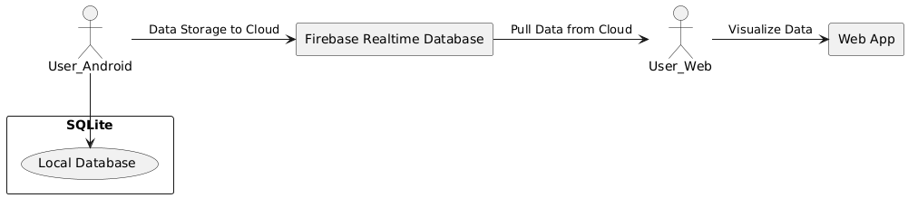

# Technical Specification for Rugby Statistics App

## Project Partners:

- Liam Wrafter-22411932
- Lotanna Nnoil-22385256

---

# Table of Contents

1. [Introduction](#1-introduction)
2. [System Architecture](#2-system-architecture)
3. [High-Level Design](#3-high-level-design)
4. [Problems and Resolutions](#4-problems-and-resolution)
5. [Installation Guide](#5-installation-guide)

---

## 1. Introduction

### 1.1 Overview

Our project was to develop a Rugby Statistics application that captures and visualises rugby statistics from ongoing matches, allowing rugby coaches, rugby fans, and analysts to collect and visualise rugby statistics live in real-time. Our project is made up of two different components: the Android application, which is used to record events that occur during a match, and a web application where users can visualise the data being collected in real-time through graphics and charts. The app supports the recording of various events such as turnovers, lineouts, and knock-ons, along with the location on the pitch, divided into eight different quadrants, where the event occurred and the player number associated with the event. The data that is collected is stored in a Firebase real-time database, ensuring synchronization of the data and it being accessible across both devices. The app uses Firebase Authentication for user authentication, which provides security and data protection for users. The system integrates Android mobile components, Firebase services, SQLite for offline local storage, and a Django-developed web interface for data visualisation.

The Django web application forms the second component of the system by retrieving and processing rugby match data from Firebase and rendering it in various dashboards. The Django app handles user sessions (through Firebase Authentication tokens) and displays real-time statistics via Chart.js charts. By keeping the data in Firebase’s Realtime Database, both the Android application and the Django web application stay synchronized, ensuring coaches and analysts can immediately see updates in a more detailed view on desktops or laptops.

### 1.2 Glossary

Define and technical terms used in this document. Only include those with which the reader may not be familiar.

- **Firebase Realtime Database**: A cloud-based database that syncs data in real-time to all connected devices.
- **Firebase Authentication**: A service offered by Firebase that enables secure authentication using email and password.
- **Android Studio**: The integrated development environment for Google’s Android operating system.
- **Django**: A high-level Python web framework used to develop the web interface that displays match data and analytics.
- **Chart.js**: A JavaScript charting library used by the Django frontend to visualize team performance and match events in various chart formats (e.g., line, bar, doughnut).
- **Firebase Admin SDK**: A server-side library used within Django to securely access Firebase services (authentication token verification, real-time database queries).

---

## 2. System Architecture

The Rugby Statistics application follows a client-server system architecture. The client side is the Android application developed using Java and designed using XML, which serves as the interface for users to record match statistics. The application communicates with Firebase’s Realtime Database to store the match data collected and for retrieval by the web application. Firebase Authentication securely manages access to user data.

### Initial Design

The initial design that we had was a more basic architecture with minimal use of third-party services. We originally planned and started to design the application to store the match data locally on the device. User authentication was originally supposed to be a simple email-password system without robust security measures and also stored locally on the device alongside the match statistics.

### Current Design

Upon evaluation of the limitations of our original design plan, we decided to make some very big changes.

Our initial design had both the data capture and data visualisation within the same Android application. We had the idea to integrate cloud storage so other users logged into the account could view the statistics as they came in live. We then decided to change how users were able to visualize the data. The initial design of the application was to have the data visualisation built into the Android application. We then realised the benefit of using cloud storage was that users were not confined to using the small screen on Android devices and instead we could build an accompanying web application for a better user experience.

We also decided to use another feature provided by Firebase, which was Firebase Authentication, which allowed us to enhance the security of user data such as their email and passwords. Firebase Authentication also includes a unique user ID that we then were able to assign to each match so only the account that created the match would be able to view the match statistics as a problem that we had run into was when a user wanted to view their previous matches they were able to see all matches saved in the database regardless of if they created the match or not.

The system architecture consists of the following components:

- **The Android application** that handles the data input, user authentication, and account creation as well as a locally stored copy of the user's previous matches.
- **Firebase Realtime Database** that was used to store match data such as events, player numbers, and pitch locations via cloud services enabling access to the database across devices.
- **Firebase Authentication** that manages users' accounts and secures the access to their data, keeping sensitive information secure.
- **SQLite** is implemented to take advantage of local storage where a copy of a user's match statistics were saved so that users could view a basic page consisting of their previously logged stats.
- **Web application** that allows users to view team performance metrics from a desktop or laptop. This offered broader accessibility to users such as coaching staff and gave us more space to design charts, graphs, and graphics to help users visualize their collected data.

Within the web application, a Django backend interfaces with Firebase through the Firebase Admin SDK. The Django project:

- Retrieves and verifies user ID tokens to handle login sessions.
- Queries the Realtime Database for match events (e.g., knock-ons, lineout wins) keyed by a match ID.
- Aggregates and summarizes data for visual representation (team event trends, player performance, pitch heatmaps).
- Renders HTML pages and uses Chart.js to display dynamic charts and tables.

---

## 3. High-Level Design

This section should set out the high-level design of the system. It should include system models showing the relationship between system components and the systems and its environment. These might be object-models, DFD, etc. Unlike the design in the Functional Specification - this description must reflect the design of the system as it is demonstrated.

### 3.1 Overview of the System Architecture

The rugby statistics recording system consists of an Android Mobile Application to record, retrieve, and display real-time statistics from a rugby match by utilizing Firebase services for things such as data storage, synchronization, and user authentication.

The system is divided into three main components:

1. **Android Mobile App**: This component allows users to input various different types of match statistics, access past statistics that the user created, and manage team data. This component includes:
   - **Create Match Activity**: In this Java activity, users input match information such as team name and opponent name.
   - **Match Actions Activity**: This activity is responsible for recording specific match statistics such as match events like knock-ons, location on the pitch, and player numbers.
   - **Previous Matches Activity**: Displays past match data retrieved from the local storage offered by SQLite.

2. **Firebase backend**: Firebase Realtime Database stores all match statistics that the user inputs, and Firebase Authentication ensures secure user login and management, keeping their email and password secure. Firebase Realtime Database is structured in a way that each match's statistics and user data are organized by match ID, enabling easy retrieval of historical data and protection against other accounts accessing the user's data.

### 3.2 Architecture Diagram

The system follows a client-server architecture, where the Android application acts as the client and Firebase acts as the server.

- **Mobile Application (the client)**:
  - The mobile application interacts with Firebase Authentication and Firebase Realtime Database via the Android application using an internet connection.
  - The app also implements user interfaces for user login, data entry and logging, and for displaying previous match statistics.

- **Firebase Cloud Services (the server)**:
  - Firebase provides backend services such as data storage and user authentication for logins.
  - Uses Firebase Authentication for secure user management and data encryption.
  - Firebase Realtime Database stores the user's match statistics such as events, player actions, and player number, and syncs that data between the Android application and the web application.

### 3.3 Data Flow

1. **User Authentication**:
   - The Android application interacts with Firebase Authentication for secure user login. Once a user is authenticated, user data is stored and synced with Firebase.

2. **Match Data Recording**:
   - The user enters various match statistics (e.g., knock-ons) in the match actions activity.
   - The statistics entered are sent to the Firebase Realtime Database, where each event is timestamped for when it was inputted and categorized by a match child and a user ID.
   - The statistics are also saved locally in an SQLite database to allow for offline viewing of match data.

3. **Match Retrieval**:
   - The previous matches activity utilizes the offline locally stored data in the SQLite database to retrieve data for past matches.
   - Match data is displayed in a list view and is dynamically structured in the Android application.

4. **Data Retrieval and Visualization in Django**:
   - Django views query Firebase (via the Admin SDK) for matches tied to the logged-in user’s UID.
   - Functions in firebase.py (e.g., get_players_performance_per_match, get_team_event_trends) reshape the raw event data for chart rendering.
   - Django templates (e.g., dashboard.html, team_performance.html) build interactive charts with Chart.js to display time-series event trends, player performance summaries, and pitch heatmaps.
   - Filtering: AJAX calls (e.g., from the filter form in team_performance.html) allow dynamic filtering by time window or pitch location, returning JSON data to update charts in real-time.

---

## 4. Problems and Resolution

### 4.1 Design Considerations:

#### User Interface Design (UI Design):

1. **Login Screen**:
   - Users can log in or create a new account via a simple email/password login interface.
   - Passwords entered by users are encrypted and stored securely by using Firebase’s Authentication.
   - After user testing, a second password field was added and both were compared to ensure the user correctly spelled out their password.
   - Text was added to explain what a password should contain and its minimum length.

2. **Create Match Activity**:
   - A clean form-based design was used to allow the user to input match information such as team name and opponent name.
   - The match date was automatically taken from the Android device when the user creates a new match.
   - The design allows for quick and easy information entry with minimum user input fields to increase user satisfaction.

3. **MatchActionsActivity**:
   - This screen is for users to input the match statistics. It consists of buttons and a text input field for entering real-time statistics during a match. The flow of data collection is included in the design from top to bottom.
   - Data is recorded via user interaction and clicking the buttons and entering text.

4. **Previous Matches Activity**:
   - This page displays a list of past matches with a simple and clean design consisting of text boxes.
   - The Match data is retrieved from the local storage and displayed in a list view.

#### Database Design:

Firebase Realtime Database is the core of data storage in our system. The database is structured as follows:

1. **User Data**:
   - Users are uniquely identified by a match ID which consists of a string of characters, each user having an associated set of team data, match statistics, and authentication credentials such as email and password.

2. **Match Data**: Match statistics are stored under the unique match ID that each newly created match is assigned to. Each match includes:
   - **Team Names**: The team and opponent names.
   - **Date and Time**: Date when the match was created and a timestamp of when an event was recorded.
   - **Events**: List of recorded match events (e.g., knock-on, lineout win, etc.).
   - **Pitch Location**: A quadrant on the pitch where the event occurred.
   - **Player Number**: The player number associated with the event.

### 4.2 Security Considerations:

Security is a critical aspect of the system as we store users’ emails and passwords, particularly around user authentication and data privacy. The system uses Firebase Authentication for secure user login, and Firebase services encrypt user information both when the data is in transit (Using HTTPS) and when the data is at rest.

1. **User Authentication**:
   - Firebase Authentication ensures that the users’ credentials (email/password) are protected and safe. Passwords are not retrievable by the user or by access through the Firebase console. When entering a password, it is not displayed and instead is replaced by black dots.
   - Token-based authentication implemented in our Django backend, ensuring each request includes the valid ID token for a logged-in user. This gave us an extra layer of security, guaranteeing only authorised users accessed sensitive endpoints. Combined with CSRF protection, it helped keep data safe.

2. **Firebase Security Rules**:
   - Firebase Realtime Database utilizes various security rules to control and restrict access to data in the database. Only authenticated users who have an account on the system can read and write their own data, preventing access to unverified users.

---

## 5. Installation Guide

### Android Installation:

The Android Application is not currently available on the Google Play Store or any other Android app store. The application can be used or installed in two different ways.

1. **Emulator**:
   - Users can access the application through the emulator provided by Android Studio. Users can download Android Studio from the Android Studio official website. Users will have to download the code from our GitLab repository and open the application on LoginScreen. Upon opening the application in Android Studio, users will see on the top of the screen there is a bar and to the right of center there will be an emulator device. To the right of that, you will see a play button that looks like the tip of an arrow pointing right. To launch the emulator, click on this button and an Android phone will appear and launch the application.

2. **Download Copy to Android Device**:
   - If you have an Android device, you are able to download and install a copy of the application. Complete the steps above to successfully download and install the required Android Studio and the directory in our repository. Users will first need to access developer options in their Android settings. This can be done by going to settings, tap about device/phone, tap software information, and tap build number seven times. This should unlock developer options on the menu page of settings and can be seen when you go back to the home page and should be located at the very bottom of the different settings options. Go into developer options and enable USB debugging. Using a USB C charger plugged into your computer and phone, users can now click the play button to launch the emulator and the app will install and launch on your device. The device on the top bar will change from the emulator to the name of your device. The app should now be installed and available to use on your device.

---

# Django Web App Installation:

### 1. Prerequisites

Before you start, please ensure you have Python 3.8+ installed on your system. You are able to check your Python version by running `python --version` in your terminal. Additionally, you'll need to have Git installed on your machine to clone the repository. A Firebase Service Account Key will be needed as well. This has been included in the Django app folder (titled **dashboard**) and is a JSON file called `rugby_credentials.json`. This has already been set up in your project for accessing Firebase Realtime Database.

Although optional, it is highly recommended to use a virtual environment to manage dependencies and avoid conflicts with other Python projects you may have on your system.

### 2. Clone the Git Repository

The first step in setting up your project is to clone the Git repository containing the project files. To do this, open your terminal and navigate to the directory where you want to store the project. Run the following commands:

bash
git clone <REPO_URL>.git
cd <REPO_FOLDER>

Replace <REPO_URL> with the actual url of the Git repository and <REPO_FOLDER> with the folder name where the project will be stored. This will copy the entire project into your local directory.

### Create and Activate a Virtual Environment

As mentioned, it would be best practice to use a virtual environment to keep the project dependencies isolated. This ensures that your Django app won’t interfere with other Python projects on your system. From the root directory of your project, where manage.py is located, run the following command to create a virtual environment:

For macOS/Linux:

python3 -m venv venv
source venv/bin/activate

For Windows:

python -m venv venv
venv\Scripts\activate
Once the virtual environment is activated, you should see (venv) at the beginning of your terminal prompt, indicating that your virtual environment is now active.

### Install Dependencies
With the virtual environment activated, the next step would be installing the necessary Python dependencies. These dependencies are listed in the requirements.txt file, which is included in the project. To install them, run the following command:
pip install -r requirements.txt
This installs the required packages, including Django, Firebase Admin SDK, and any other dependencies the project needs.

### Run the Django Development Server
Now that all dependencies are installed and Firebase credentials are set up, you can start the Django development server. This will allow you to run the application locally on your machine. To start the server, run the following command in the terminal:
python manage.py runserver
This command starts the development server on the default address http://127.0.0.1:8000/, which you can access in your web browser. You should now see the Django app running locally on your machine.

