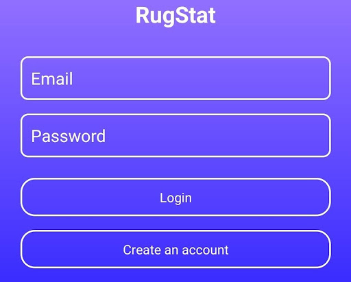
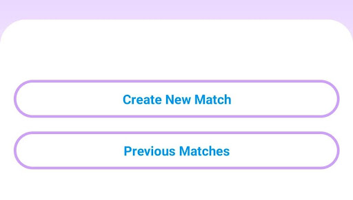
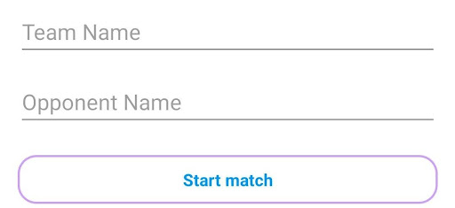
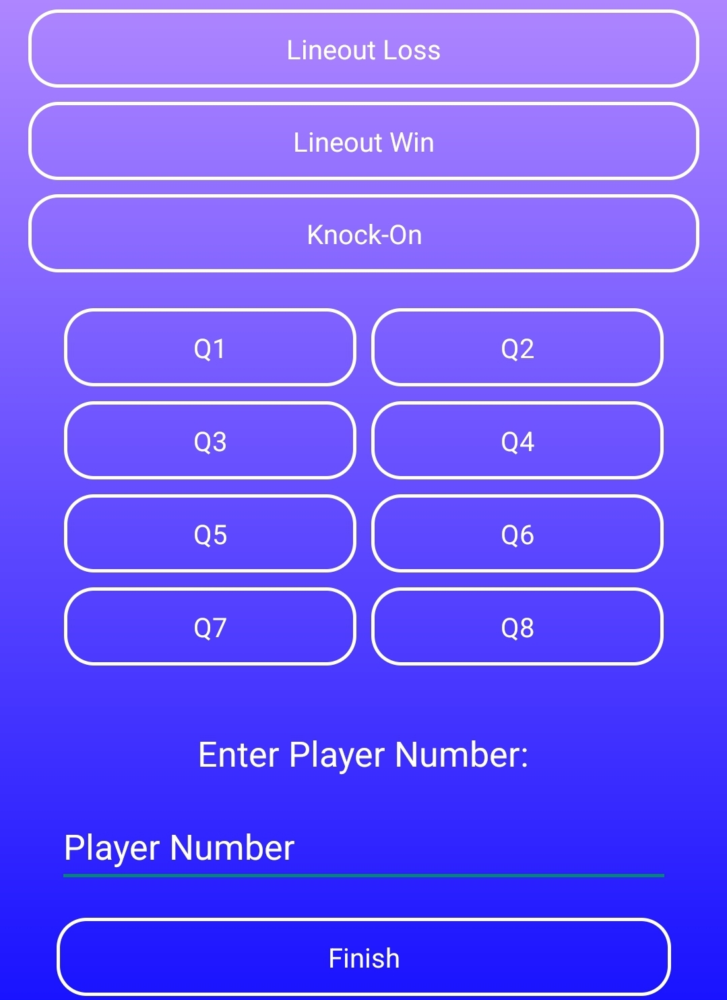
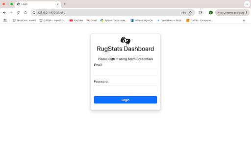
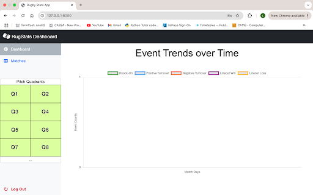
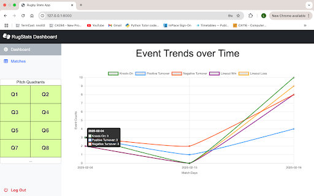
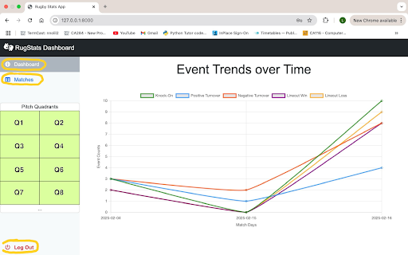
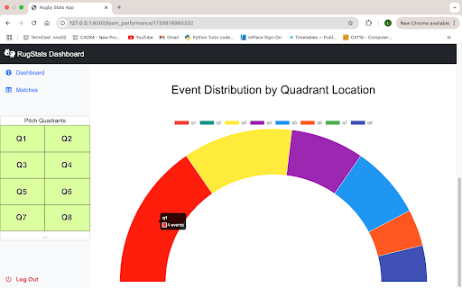
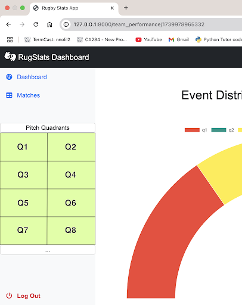

# User manual
### Project Title: Rugby Statistics app
### Student 1 Name: Liam Wrafter ID Number: 22411932
### Student 2 Name: Lotanna Nnoli ID Number: 22385256
### Staff Member Consulted: Mark Roantree

**Introduction**
Rugstat is a rugby statistics application that can be used on any android device and analytics can be viewed via a web application. Coaches, analysts and rugby fans can use this app to collect various rugby statistics during a live rugby match and those statistics can be viewed via the web application. The main features offered by Rugstat are creating matches in order to track various match events, record player and team performance, and view your team's statistics in various different visual ways.

## Getting Started

**System requirements**
In order to record the statistics you will need an android device, however any person with access to a teams account can view team performance via the web application. The only hardware needed is an android device, a pc/laptop and an internet connection. The application runs best on a newer android device and has not been tested on older android devices. While you record match statistics using the android app, team statistics and performance can be viewed via a web application on any PC or Laptop that has access to the internet. An internet stable internet connection is required while using the app for user authentication and for syncing data with firebase realtime database.

**Launching application**
The application can be downloaded and once installed, tap the android icon to open the app and begin the setup process. When launching the application you will see a login screen. New users can click on the create an account button where you will need to enter an email address and a unique password. After successfully creating an account, you will be redirected to the login page where you can now enter your valid email address and password.

**Data protection**
This application uses firebase authentication in order to protect users data and ensure secure logins. Firebase offers various strong encryption methods in order to safeguard sensitive user information. Firebase services encrypt data in transit using HTTPS and logically isolate users' data. Firebase authentication in addition to this encrypt data at rest making sure user data is secure. By utilizing these security features users can be sure that your account and match data are kept safe and private.

**How to use the app**
Once a user has successfully created an account and used that account to login to the app they will enter the menu screen. On the menu page you will see two buttons “Create New Match” and “View Statistics”. Below are instructions on how to use each of these options.

**Creating a new match**
When on the menu screen, tap on the “Create New Match” button. You will now be able to enter your team name and the opponents team name. After entering the names you can click on the “Start Match” button. The date is automatically added to the database when the user taps the “Start Match” button. 

**Record Match Statistics**
After successfully entering the team names you will be taken to the event recording page. Here you can enter statistics of a match. The first five buttons are the events that can be recorded. These include Positive Turnover, Negative Turnover, Lineout Win, Lineout Loss and Knock-on. The next group of buttons below the event buttons are the location buttons. These buttons are organized in the layout of a rugby pitch. These buttons go from Q1 to Q8 where Q1 and Q2 is the direction of attack and closest to the opponents try line. After that you are able to enter the player number below the location buttons. When you have entered an event, a location and a player number you can click finish and immediately enter another statistic. The app uses firebase realtime database, therefore the match statistics will be instantly available to see on the web application. To return to the menu page simply tap your android back button which is the left pointing arrow “<” on the bottom right of your android device.

**View Previous Matches Statistics**

Users are able to view the previous match statistics on a device by clicking on the Previous Matches button located on the menu screen underneath the Create New Match button.

## Overview of the Web App
This platform works hand-in-hand with a companion Android app that collects real-time match data (like knock-ons, turnovers, lineouts, etc.). The web interface then visualises that data through charts and graphs so coaches, analysts, and fans can quickly identify trends and track performance.
Key Features You’ll Be Using:
Dashboard: Displays an overview of event trends over time (e.g. number of knock-ons, turnovers, etc.).
Matches Page: Lists past matches recorded from your Android app, with options to explore in-depth performance stats.
Live Performance View: Offers detailed, match-specific statistics, including bar charts, time-based filters, and a special doughnut chart (heatmap adaptation) to reveal the pitch locations with the most events.
Navigation Sidebar: Lets you switch between the dashboard, your matches and your logout option.

**Logging In and Accessing the Dashboard**
Step-by-Step Login
Open Your Browser: Navigate to the web app’s URL (e.g. http://<your-server-address>/).
Enter Your Credentials: You will see a Login Page asking for a valid email (username) and password. These credentials must have been created previously through the Android app (where user accounts are managed with Firebase Authentication).

Click “Login”: Once authenticated, you will be directed to the Dashboard.

**Understanding the Dashboard Layout**
Event Trends Over Time:
At first, if you have no recorded matches, the charts may appear empty.
As matches are created on the Android app, the dashboard’s line charts update automatically.
Events Shown: Typically, you’ll see five lines series for:
Knock-On
Positive Turnover
Negative Turnover
Lineout Win
Lineout Loss
Axes:
The X-axis shows match days (for example 2025-02-04, 2025-02-15, etc.).
The Y-axis shows the count of each event type.

Tip: Each color-coded line corresponds to one of the five event types so you can easily spot trends and changes as subsequent match days occur.

# Navigating the Sidebar and Matches Page
**Sidebar Navigation**
On the left side, you’ll see a fixed sidebar. This is your main navigation panel. Common buttons or links include:
Dashboard: Returns you to the main overview of event trends.
Matches: Takes you to the page where you can view all recorded matches.
Logout: Logs you out of the web app and returns you to the login screen.

**Viewing Your Matches**
Click the Matches link on the sidebar to visit a page listing all previously recorded matches (if any):
If you have no matches, you’ll see a friendly message indicating none are currently recorded.
If you have one or more matches, each match appears as a content card with:
Match date information.
A “View Performance” button to explore in-depth stats for that match.
Why This Page Is Helpful: It centralises all your existing matches, so you can quickly pick which one you want to analyze in detail.

^ Displays when Matches become Available 
Viewing Live Team Performance
Accessing Match-Specific Stats
From the Matches page, locate the match you want to investigate.
Click “View Performance”.
You will be redirected to a new page showing charts and filters dedicated to that specific match.
Bar Chart Overview
At the top of this page is a bar chart that displays the count of events for each player in the match:
Default View: The bar chart shows all-time counts (full match duration).
Labels and Colors: Each bar is typically a different color, and player numbers may appear along the chart’s X-axis.
Dynamic Filters (Above the Bar Chart) You’ll see a few dropdowns or selection fields that let you narrow your focus:
Time Interval (e.g., last 5, 10, or 15 minutes)
Player (e.g., show only events for player #9)
Pitch Quadrant (e.g., top-left, bottom-right, etc.)
You can mix and match these filters for a more detailed, 3-dimensional view. For example, filter to the last 15 minutes plus Player #9 plus a single pitch quadrant.
Resetting the Chart
If you wish to remove all filters and return to the default “all-time” match view, look for a “Reset” or “Clear Filters”button. Clicking it restores the original bar chart display.

**Exploring the Heatmap (Adapted Doughnut Chart)**
Heatmap at a Glance
Below the bar chart, you will see an adapted doughnut chart that simulates a heatmap of events:
Each segment corresponds to one of the pitch quadrants.
The size or color of each segment indicates the volume of events happening in that location.
Labels at the top of the chart identify which quadrant or event is represented, making it simpler to spot “hotspots” of activity.

How It’s Useful
If a particular quadrant consistently shows a large number of events (e.g., repeated knock-ons in the bottom-right), coaches can focus training or match strategy there.

Side Note: Helpful Pitch Quadrant Image
In the sidebar, there is a small diagram indicating which quadrant is which. This is especially handy if you are new to rugby layouts.

**Final Notes and Tips**
Refreshing Data: Whenever new events are captured via the Android app, refreshing your browser will pull in the latest counts from the server.
Logging Out: To log out and secure your session, simply click “Log Out” in the sidebar.
Security Reminder: Ensure to use strong passwords and keep your User credentials confidential.

